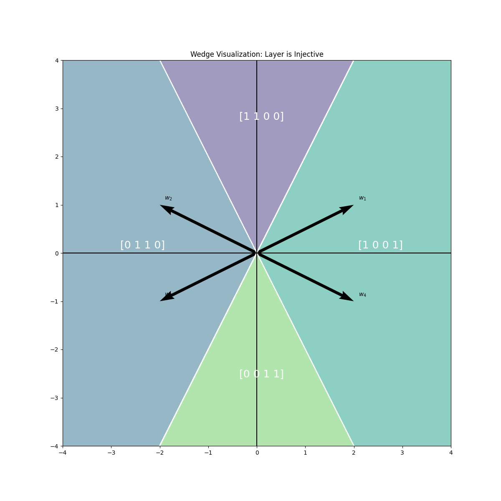
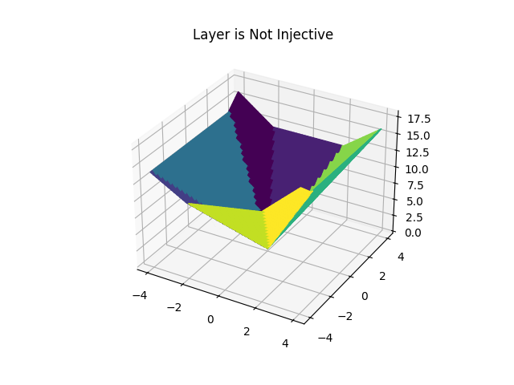
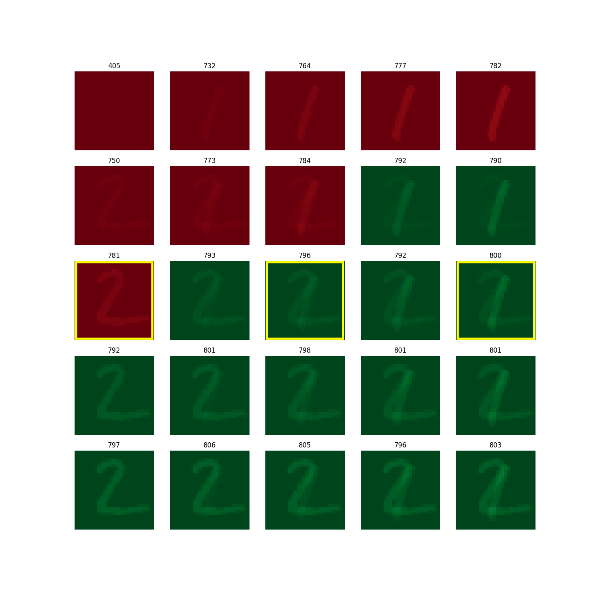
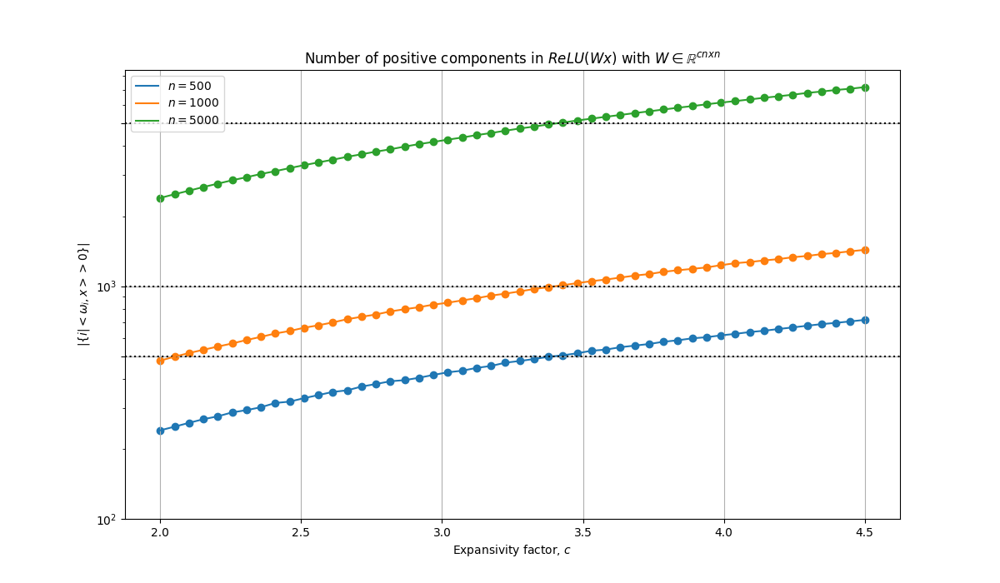
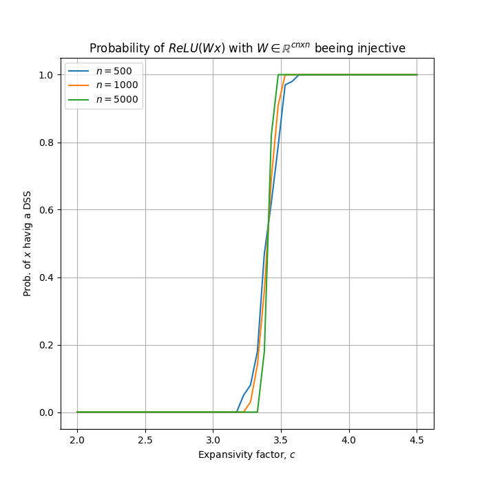

# Reproduce Figures from [Globally Injective ReLU Networks](https://arxiv.org/abs/2006.08464)

## Description

This repo reproduces the results of Figure 2,6 and 7 in the paper [Globally Injective ReLU Networks](https://arxiv.org/abs/2006.08464).

### Figure 2

Given a weight matrix $W$ test wether the layer $ReLU(W x)$ is injective or not and visualizes the wedges. These wedges correspond to areaes in $\mathbb{R}^2$ that after the ReLU layer have the same sign patterns. A layer is injective if each wedge has atleast 2 positive components. In the left plot 2 wedges only have 1 positive component (indicated with red text) even thogh the matrix $W$ is full rank $ReLU(Wx)$ is thus not injective. On the other hand the missle plot shows a constalation in which the layer is injective (each wedge has atleast 2 positive components).

<div style="display: flex; justify-content: space-around;">
    
    
    
</div>

### Figure 6

An example on the MNIST Dataset:

<div style="display: flex; justify-content: space-around;">
    
</div>

### Figure 7

This figure shows withch expansion factor $c$ is necesarry to make a mapping from $\mathbb{R}^n$ to $\mathbb{R}^{cn}$ with a ReLU layer $y = ReLU(Wx)$ injective. The layer is injective if y has atleast n positive components. The left figure shows, for differemnt values of $n$ howmany positive components of $y$ there are over differnt $c$. The right plot shows the probability of a layer beeing injective for different values of $n$ depending on the expansion factor $c$.

<div style="display: flex; justify-content: space-around;">
    
    
</div>


## Installation

1. Create a virtual environment: `python3 -m venv [venv_name]`
2. Activate the virtual environment: `source [venv_name]\bin\activate`
3. Upgrade pip: `pip install --upgrade pip`
4. Install dependencies: `pip install -r requirements.txt`

## Usage

**Run the script:** `python3 wedge_visualization.py --mode=Paper`

* With `mode=Paper` the script will reproduce Figure 2 from the paper
* Set `mode=Random` to visualize the wedges of a random weight matrix, in this mode `--num_weights` can be set as the number of vectors of the weight matrix (high values will result in a high computational time). Also if `check_inverse` is set to `True` the wedges of the same random weight matrix including the inverse of all of its vectors will be shown. This guarantees inactivity. (I recommend setting this to `False` if you are using a large number of vectors to avoid computational overhead)

The images will be stored in the `img` folder.

## The Paper

The [Globally Injective ReLU Networks](https://arxiv.org/abs/2006.08464) paper:
```
@misc{puthawala2021globallyinjectiverelunetworks,
      title={Globally Injective ReLU Networks}, 
      author={Michael Puthawala and Konik Kothari and Matti Lassas and Ivan Dokmanić and Maarten de Hoop},
      year={2021},
      eprint={2006.08464},
      archivePrefix={arXiv},
      primaryClass={cs.LG},
      url={https://arxiv.org/abs/2006.08464}, 
}
```